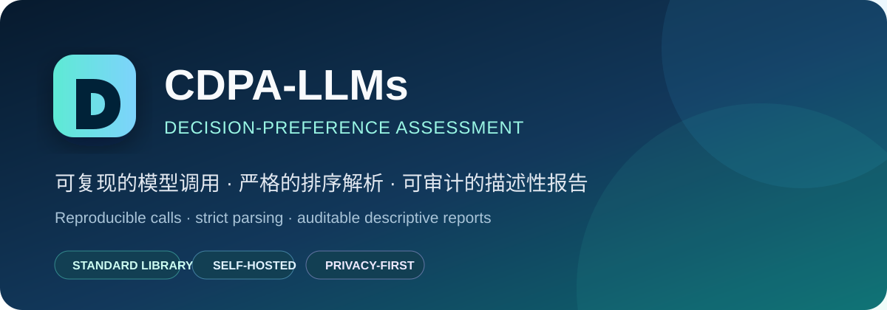
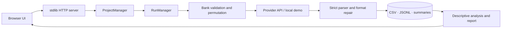

<div align="center">
  

  <p><strong>A transparent, self-hosted, reproducible decision-preference assessment pipeline for LLMs</strong></p>

  <p>
    <a href="README.md">简体中文</a> · <a href="README.en.md">English</a>
  </p>

  <p>
    <a href="https://github.com/wsLuYao/CDPA-LLMs/actions/workflows/ci.yml"></a>
    <a href="LICENSE"></a>
    
    
    <a href="https://github.com/wsLuYao/CDPA-LLMs/stargazers"></a>
  </p>
</div>

CDPA-LLMs unifies question-bank validation, provider calls, option-position randomization, strict ranking parsing, format repair, resumable execution, and descriptive reporting in one auditable workflow. It uses only the Python standard library and native Web technologies, so it runs locally without dependency installation and can also be self-hosted with Docker Compose.

> [!IMPORTANT]
> This repository ships **12 fully synthetic schema examples**, not the formal research banks. It contains no participant records, human-reference dataset, application materials, or historical assessment results. Outputs describe model choices under a particular configuration and time; they are not psychological diagnoses, capability rankings, or ground truth.

## Why CDPA-LLMs?

| Capability | Implementation |
| --- | --- |
| Reproducible calls | Versioned prompts and parsers, deterministic seeds, and public model configuration |
| Strict data contract | UTF-8 / GB18030 detection plus validation of required three-option fields |
| Position-bias control | Original, randomized, or balanced six-permutation presentation with canonical remapping |
| Reliable runs | Concurrency, rate limiting, technical retries, format repair, pause/cancel, and deduplicated resume |
| Auditable artifacts | Ranking CSV, complete CSV, raw-response JSONL, run summary, and project archive |
| Descriptive analysis | Quality, coverage, stability, profiles, context effects, model similarity, and divergence |
| Self-hosted security | API keys remain in process memory; online mode adds accounts, sessions, CSRF, and endpoint constraints |

## Start in three minutes

Python 3.11+ is required. There are no third-party runtime packages.

```bash
git clone https://github.com/wsLuYao/CDPA-LLMs.git
cd CDPA-LLMs
python server.py
```

Open <http://127.0.0.1:8765>, create an assessment, and choose “Local demo (no API call)” to exercise the complete pipeline with the synthetic banks. The deterministic demo provider validates the software flow only; it does not produce research data.

When connecting a real provider, select it in the UI and enter an API key. The key is not persisted, but question content is sent to the provider you configure. Review that provider's data policy and your authorization before use.

## How it works



Read [Architecture](docs/ARCHITECTURE.md) for the design and [Question-bank schema](docs/QUESTION_BANK_SCHEMA.md) to connect your own authorized CSV files.

## Repository layout

```text
CDPA-LLMs/
├─ app/                    # Auth, CSV parsing, orchestration, providers, and analysis
├─ web/                    # Build-free Web UI and professional statistics appendix
├─ question_banks/         # Four synthetic domains, three examples each
├─ human_reference/        # Intentionally empty; integration guidance only
├─ tests/                  # Unit, end-to-end, isolation, and resume tests
├─ scripts/                # Docker deployment, diagnostics, status, and backups
├─ docs/                   # Architecture, data policy, and CSV contract
├─ server.py               # Local and online entry point
└─ compose.yaml            # Single-host Caddy + application deployment
```

## Tests

```bash
python -m unittest discover -s tests -v
python -m compileall -q app server.py tests
```

CI runs the full suite on Ubuntu and Windows with Python 3.11 and 3.12, then checks JavaScript and shell syntax.

## Public distribution boundary

| Included | Not distributed here |
| --- | --- |
| Complete backend and frontend implementation | The 936 formal research conditions and their stimuli |
| Four synthetic CSV samples | Any participant or human-reference records |
| Provider, recovery, and report engines | API keys, account databases, run outputs, and server configuration |
| Docker/Caddy deployment implementation | Proposals, slides, registration, and competition materials |

Place an authorized bank in `question_banks/` using the documented contract. Never commit restricted stimuli, raw provider responses, or participant data. See [Data and privacy policy](docs/DATA_POLICY.md).

## Deployment note

`python server.py` listens on localhost by default. For public deployment, use `compose.yaml` with HTTPS, a strong random registration code, trusted origins, backups, and access control. Read [SECURITY.md](SECURITY.md) first; never expose local mode directly to the internet.

## Contributing

Small, reproducible improvements are welcome. Read [CONTRIBUTING.md](CONTRIBUTING.md) before opening a pull request. Report vulnerabilities privately through GitHub Security Advisories and never paste keys, raw private prompts, or restricted banks into a public issue.

## License

The code and bundled synthetic examples are released under the [MIT License](LICENSE). Trademarks, third-party model APIs, and datasets you connect remain subject to their own terms. See [NOTICE](NOTICE).

<div align="center">
  <sub>Build measurements you can inspect, reproduce, and challenge.</sub>
</div>
