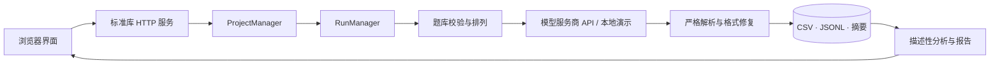

<div align="center">
  

  <p><strong>CDPA-LLMs 大语言模型决策偏好测评软件</strong></p>

  <p>
    <a href="README.md">简体中文</a> · <a href="README.en.md">English</a>
  </p>

  <p>
    <a href="https://github.com/wsLuYao/CDPA-LLMs/actions/workflows/ci.yml"></a>
    <a href="LICENSE"></a>
    
    
    <a href="https://github.com/wsLuYao/CDPA-LLMs/stargazers"></a>
  </p>
</div>

CDPA-LLMs 把题库校验、模型调用、选项位置随机化、严格排序解析、格式修复、断点恢复和描述性报告放进同一套可审计流程。项目只依赖 Python 标准库和原生 Web 技术，可以在本机直接运行，也可以通过 Docker Compose 自托管。

> [!IMPORTANT]
> 本仓库附带的是 **12 条完全合成的格式样例**，不是正式研究题库；不包含参与者数据、人类参照记录或历史测评结果。输出描述特定配置与时间下的模型选择模式，不是心理诊断、能力排名或“正确答案”。

## 为什么用 CDPA-LLMs？

| 能力 | 实现 |
| --- | --- |
| 可复现调用 | 固定提示词版本、解析器版本、随机种子与模型公开配置 |
| 严格数据契约 | 自动识别 UTF-8 / GB18030，校验三选项题库与必需字段 |
| 位置偏差控制 | 原顺序、随机顺序或六种排列平衡呈现，并还原到逻辑选项 |
| 可靠运行 | 并发、限速、技术重试、格式修复、暂停/取消与不重复断点恢复 |
| 可审计输出 | 排序结果、完整记录、原始响应日志、运行摘要与项目压缩包 |
| 描述性分析 | 质量、覆盖率、稳定性、画像、情境效应、模型相似度与差异维度 |
| 自托管安全 | API Key 仅保留在进程内存；线上模式含账号、会话、CSRF 与端点约束 |

## 3 分钟启动

需要 Python 3.11 或更高版本，无需安装第三方包。

```bash
git clone https://github.com/wsLuYao/CDPA-LLMs.git
cd CDPA-LLMs
python server.py
```

浏览器打开 <http://127.0.0.1:8765>，新建测评时选择“本地演示（不调用 API）”，即可用合成题库走完整流程。演示模型只验证程序，不产生研究数据。

接入真实模型时，在界面中选择厂商并填写 API Key。平台不会把 Key 写入磁盘，但题目内容会按你的配置发送给相应服务商；请先确认其数据政策与使用权限。

## 工作原理



更深入的设计说明见 [架构文档](docs/ARCHITECTURE.md)，题库接入见 [CSV 数据契约](docs/QUESTION_BANK_SCHEMA.md)。

## 项目结构

```text
CDPA-LLMs/
├─ app/                    # 认证、题库解析、运行编排、服务商适配与分析
├─ web/                    # 无构建步骤的原生 Web 界面与专业统计附录
├─ question_banks/         # 四类合成示例（每类 3 条）
├─ human_reference/        # 公开版为空，仅保留接入说明
├─ tests/                  # 单元、端到端、权限隔离与恢复测试
├─ scripts/                # Docker 部署、诊断、状态与备份脚本
├─ docs/                   # 架构、数据政策与题库格式
├─ server.py               # 本地/线上启动入口
└─ compose.yaml            # Caddy + 应用的单机部署方案
```

## 测试

```bash
python -m unittest discover -s tests -v
python -m compileall -q app server.py tests
```

CI 会在 Ubuntu 与 Windows、Python 3.11 与 3.12 上运行全部测试，同时检查 JavaScript 与 Shell 语法。

## 公开版范围

| 已公开 | 未随仓库发布 |
| --- | --- |
| 完整后端与前端实现 | 936 条正式研究条件及其题干 |
| 四类合成 CSV 样例 | 任何参与者或人类参照数据 |
| 模型适配、恢复与报告引擎 | API Key、账号库、运行结果与服务器配置 |
| Docker/Caddy 部署实现 | 计划书、PPT、软著与比赛申报材料 |

如果你有合规授权的自有题库，可以按文档放入 `question_banks/`；不要把受限题目、原始响应或参与者数据提交到 Git。完整边界见 [数据与隐私政策](docs/DATA_POLICY.md)。

## 部署提醒

`python server.py` 默认只监听本机。公开部署请使用 `compose.yaml`，配置 HTTPS、强随机注册邀请码、受信任来源、备份和访问控制。部署前请阅读 [SECURITY.md](SECURITY.md)，不要直接把本地模式暴露到公网。

## 参与贡献

欢迎提交小而可复现的改进。开始前请阅读 [CONTRIBUTING.md](CONTRIBUTING.md)；安全问题请通过 GitHub Security Advisory 私下报告，不要公开粘贴 Key、原始响应或私有题库。

## 许可证

代码与随附合成样例采用 [MIT License](LICENSE)。商标、第三方模型/API 与你自行接入的数据仍受各自条款约束。详见 [NOTICE](NOTICE)。

<div align="center">
  <sub>Build measurements you can inspect, reproduce, and challenge.</sub>
</div>
