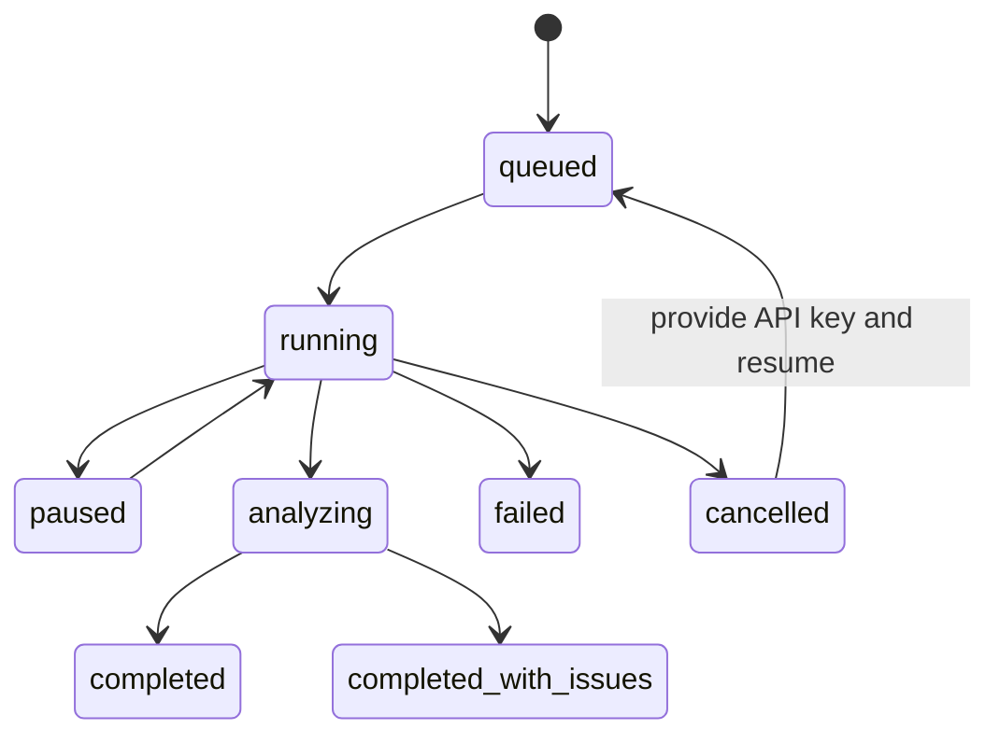

# 架构 / Architecture

[中文](#中文) · [English](#english)

## 中文

CDPA-LLMs 采用无框架、低依赖设计：Python 标准库提供 HTTP、并发、SQLite、CSV 与压缩能力；浏览器端使用原生 HTML/CSS/JavaScript。核心目标是让一次模型测评的输入、配置、位置变换、原始输出、解析结果和统计摘要都可追溯。

### 组件

| 组件 | 职责 |
| --- | --- |
| `server.py` | 解析本地/线上启动参数，选择可写数据目录并启动 HTTP 服务 |
| `app/web_server.py` | 静态文件与 JSON API、会话/CSRF、下载与安全响应头 |
| `app/auth.py` | scrypt 密码摘要、哈希会话令牌、SQLite 持久化 |
| `app/csv_loader.py` | 编码识别、字段映射、三选项题库校验和安全路径解析 |
| `app/providers.py` | Responses、Chat Completions、Gemini REST 和确定性演示适配 |
| `app/runner.py` | 任务展开、排列、并发/限速、重试、解析、逐条持久化与恢复 |
| `app/project_manager.py` | 多模型项目编排、所有权隔离、状态汇总与报告生成 |
| `app/public_analysis.py` | 按题、分类、情境与模型生成描述性统计 |
| `web/advanced/` | 浏览器端的专业统计附录与导出工具 |

### 状态与持久化

API Key 只存在于当前进程内存中。可恢复信息写入 `results/run_*/运行摘要.json` 与项目摘要；恢复时必须重新提供一致的模型配置和 Key。每个已提交任务按 `TaskIndex` 去重，避免重复调用。

### 信任边界

浏览器和本机服务属于部署者控制面；外部模型服务商属于第三方数据接收方。线上模式只允许 HTTPS 公网端点，并拒绝解析到私网、环回、链路本地或保留地址的目标，以降低 SSRF 风险。DNS 重绑定仍应通过出口防火墙、代理白名单和网络隔离进一步控制。

## English

CDPA-LLMs deliberately avoids application frameworks. The Python standard library supplies HTTP, concurrency, SQLite, CSV, and archive support; the browser uses native HTML, CSS, and JavaScript. The design keeps inputs, public configuration, option permutations, raw output, parsing decisions, and descriptive summaries traceable.

The component table above maps each module to its responsibility. A run expands bank rows into uniquely indexed tasks, optionally permutes displayed options, calls the selected provider, parses the strict ranking, and commits each result before moving on. Resume reconstructs the task list and skips every committed `TaskIndex`.

API keys remain in memory and must be supplied again after a restart. Online mode requires HTTPS public provider endpoints and rejects private, loopback, link-local, and reserved addresses. Production operators should still enforce outbound allowlists and network isolation to reduce DNS-rebinding and provider-proxy risks.
